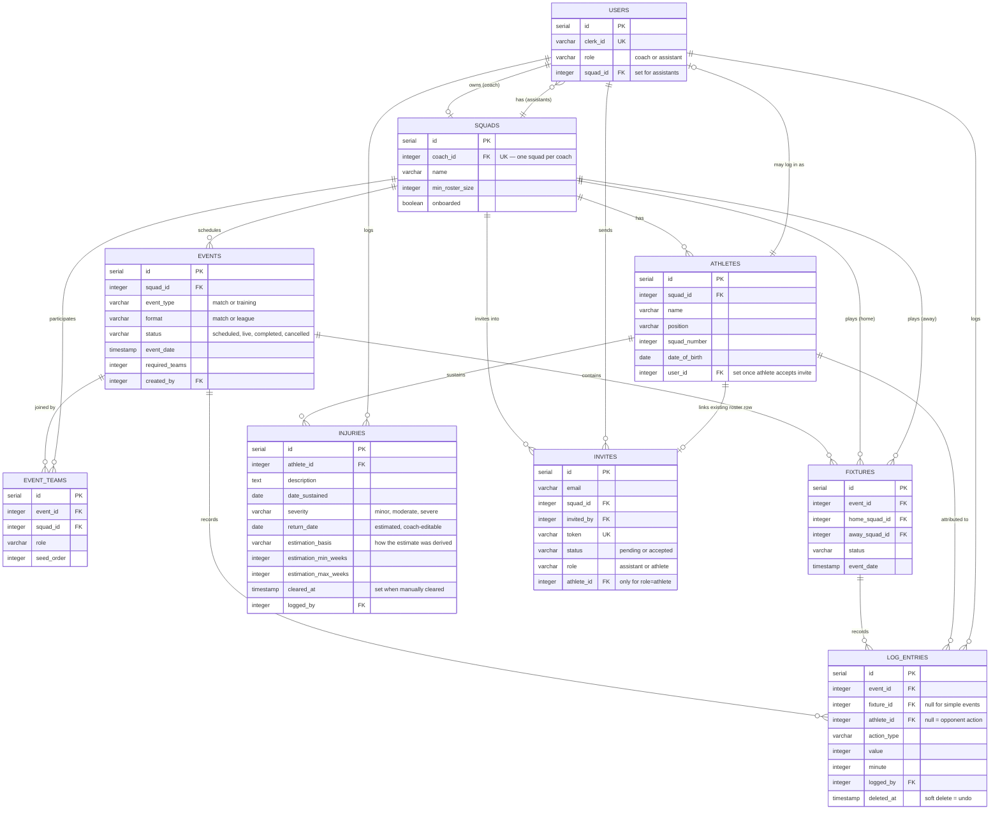

# Data Model

:::caution Keep this in sync
This reflects the schema as of the migrations in `backend/migrations/` at
the time of writing. Migrations are the source of truth — if this page and
the migrations folder disagree, trust the migrations, and please update this
page (or flag it for someone to).
:::

## Entity-relationship diagram



Two relationships worth calling out since they're easy to misread from
the diagram alone:

- **`SQUADS ||--o{ FIXTURES`** appears twice (home and away) — a fixture
  always references two different squads, both via the same
  `squads.id` foreign key pattern, just in two separate columns
  (`home_squad_id`, `away_squad_id`).
- **`ATHLETES ||--o| INVITES`** is optional and only set when
  `invites.role = 'athlete'` — it links an invite to an *existing*
  roster row (so accepting it attaches login access to that athlete's
  existing stats history) rather than creating a disconnected account.
  Assistant invites don't use this field at all.

---
## Design rationale

### Why a relational model?

The sport coaching domain is inherently relational:
- A **coach** owns exactly one **squad**, and a squad has many **athletes**.
- **Events** belong to a squad and contain **log entries** attributed to specific athletes.
- **Fixtures** connect two squads (home and away) within a **league event**.

PostgreSQL was chosen over alternatives (MongoDB, SQLite) because:
1. **Referential integrity** — foreign keys and cascade deletes ensure that removing a squad automatically cleans up its athletes, events, and log entries.
2. **Complex queries** — standings calculations (points, goal difference, goals for) require JOINs and aggregations that are natural in SQL but awkward in document stores.
3. **Concurrency** — multiple assistants logging simultaneously (advanced tier) requires transaction support.

### Key design decisions

| Decision | Motivation |
|----------|------------|
| `squads.coach_id` is unique | A coach owns exactly one squad. This prevents duplicate squads and simplifies ownership lookups. |
| `athletes.user_id` is nullable and optional | Athletes exist on the roster before they have an account. When they accept an invite, `user_id` is set to link them. |
| `log_entries.deleted_at` for soft deletes | "Undo" doesn't destroy data — it timestamps the row as deleted. This preserves audit history and allows recovery. |
| `invites.athlete_id` is nullable | Assistant invites don't link to a roster row. Only athlete invites do, so accepting the invite attaches login to the existing stats. |
| `events.status` is a string, not an enum | Allows adding new statuses (e.g., `postponed`) without a migration. |
| Statistics are computed on read | Avoiding a separate `stats` table means the log is the single source of truth. Stats can never drift out of sync. |
| `fixtures` are separate from `events` | A league event contains many fixtures. Keeping them in separate tables allows each fixture to have its own log, status, and date. |
| `injuries.return_date` is an estimate, not a verdict | The estimator derives a range from sports-medicine reference tables and stores the midpoint with its basis (`estimation_basis`). Coaches can override it (US30) — the stored value is always what the coach last confirmed. |
| `injuries.cleared_at` for early clearance | Recovery often beats the estimate. Setting `cleared_at` keeps the injury history for the athlete's record while dropping the active-injury flag. |

## Tables

### `users`

| Column | Type | Notes |
|---|---|---|
| `id` | serial, PK | |
| `clerk_id` | varchar(255), unique, not null | Links to the Clerk-hosted account |
| `role` | varchar(20), not null, default `'coach'` | `'coach'` or `'assistant'` |
| `squad_id` | integer | Set for assistants (see `fk_users_squad`); a coach's squad is instead found via `squads.coach_id` |
| `created_at` | timestamp | |

### `squads`

| Column | Type | Notes |
|---|---|---|
| `id` | serial, PK | |
| `coach_id` | integer, not null, references `users`, `ON DELETE CASCADE` | **Unique** — a coach owns exactly one squad |
| `name` | varchar | Defaults to `'My Squad'` on self-heal creation |
| `created_at` | timestamp | |

### `athletes`

| Column | Type | Notes |
|---|---|---|
| `id` | serial, PK | |
| `squad_id` | integer, not null, references `squads`, `ON DELETE CASCADE` | |
| `name` | varchar(100), not null | |
| `position` | varchar(50) | |
| `squad_number` | integer | |
| `date_of_birth` | date | |
| `contact_info` | varchar(255) | |
| `created_at` / `updated_at` | timestamp | |

### `events`

| Column | Type | Notes |
|---|---|---|
| `id` | serial, PK | |
| `squad_id` | integer, not null, references `squads`, `ON DELETE CASCADE` | |
| `title` | varchar(150) | Free-text title (calendar-form events) |
| `opponent` | varchar(100) | Set for matches |
| `event_type` | varchar(20), not null, default `'match'` | `'match'` or `'training'` |
| `event_date` | timestamp, not null | |
| `location` | varchar(255) | |
| `duration_minutes` | integer, not null, default `90` | Used by the auto-transition sweep |
| `status` | varchar(20), not null, default `'scheduled'` | `'scheduled'` → `'live'` → `'completed'`, or `'cancelled'` |
| `created_by` | integer, not null, references `users` | |
| `created_at` / `updated_at` | timestamp | |

### `log_entries`

The core of live event tracking — one row per logged action.

| Column | Type | Notes |
|---|---|---|
| `id` | serial, PK | |
| `event_id` | integer, not null, references `events`, `ON DELETE CASCADE` | |
| `athlete_id` | integer, references `athletes`, `ON DELETE SET NULL` | `null` = action attributed to the opponent (e.g. their goal) |
| `action_type` | varchar(30), not null | e.g. `'goal'`, `'yellow_card'`, `'red_card'`, `'penalty'`, `'save'` |
| `is_scoring` | boolean, not null, default `false` | Whether this action contributes to the result |
| `value` | integer, not null, default `1` | Points/goals contributed if scoring |
| `minute` | integer | |
| `notes` | varchar(255) | |
| `logged_by` | integer, not null, references `users` | Who made the entry |
| `logged_at` | timestamp, not null, default `now()` | |
| `updated_at` | timestamp | |
| `deleted_at` | timestamp | **Soft delete** — set on "undo"; the row is kept for audit history but excluded from live views |

### `injuries`

Roster availability tracking (US29–US31). One row per logged injury.

| Column | Type | Notes |
|---|---|---|
| `id` | serial, PK | |
| `athlete_id` | integer, not null, references `athletes`, `ON DELETE CASCADE` | |
| `description` | text, not null | Free text; keyword-matched against the estimator's injury reference table |
| `date_sustained` | date, not null | |
| `severity` | varchar(20), not null, default `'moderate'` | `'minor'`, `'moderate'`, or `'severe'` (CHECK constraint) |
| `return_date` | date | Estimated return-to-play date; coach-editable override (US30) |
| `estimation_basis` | varchar(255) | Human-readable note on how the estimate was derived (matched injury vs severity default) |
| `estimation_min_weeks` / `estimation_max_weeks` | integer | The reference range the midpoint was taken from |
| `cleared_at` | timestamp | Set when the coach manually clears the athlete early (US31) |
| `logged_by` | integer, not null, references `users` | Coach or assistant — matches live-logging access |
| `created_at` / `updated_at` | timestamp | |

### `invites`

| Column | Type | Notes |
|---|---|---|
| `id` | serial, PK | |
| `email` | varchar(255), not null | |
| `squad_id` | integer, not null, references `squads`, `ON DELETE CASCADE` | |
| `invited_by` | integer, not null, references `users` | |
| `token` | varchar(255), not null, unique | Used to build the invite link |
| `status` | varchar(20), not null, default `'pending'` | `'pending'` or `'accepted'` |
| `created_at` | timestamp | |

## Foreign key summary

```
users ──┐
        ├─(coach_id, unique)── squads ──(squad_id)── athletes
        │                         │
        │                         ├─(squad_id)── events ──(event_id)── log_entries
        │                         │                                        │
        │                         └─(squad_id)── invites                   │
        │                                                                  │
        └──(squad_id, nullable, ON DELETE SET NULL)                        │
        └──(created_by / logged_by / invited_by, on events/log_entries/invites)
                                                        athletes ──(athlete_id, ON DELETE SET NULL)┘
```

## Statistics are derived, not stored

Per-athlete and per-event statistics (goals, cards, appearances, result) are
computed on read from `log_entries`, not stored as separate columns —
keeping the log the single source of truth and avoiding stats drifting out
of sync with the entries they're supposed to summarise.

The same applies to roster availability: `GET /api/athletes` computes an
`is_injured` flag per athlete with an `EXISTS` subquery over `injuries`
(active = not cleared and `return_date >= CURRENT_DATE`), so the flag
clears itself the day the estimated return date passes without any
background job needed.
