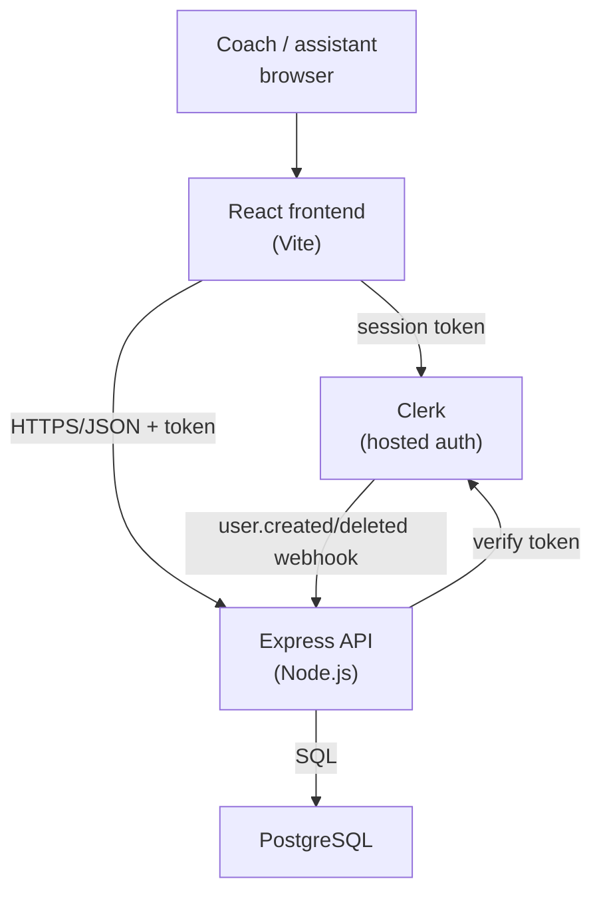
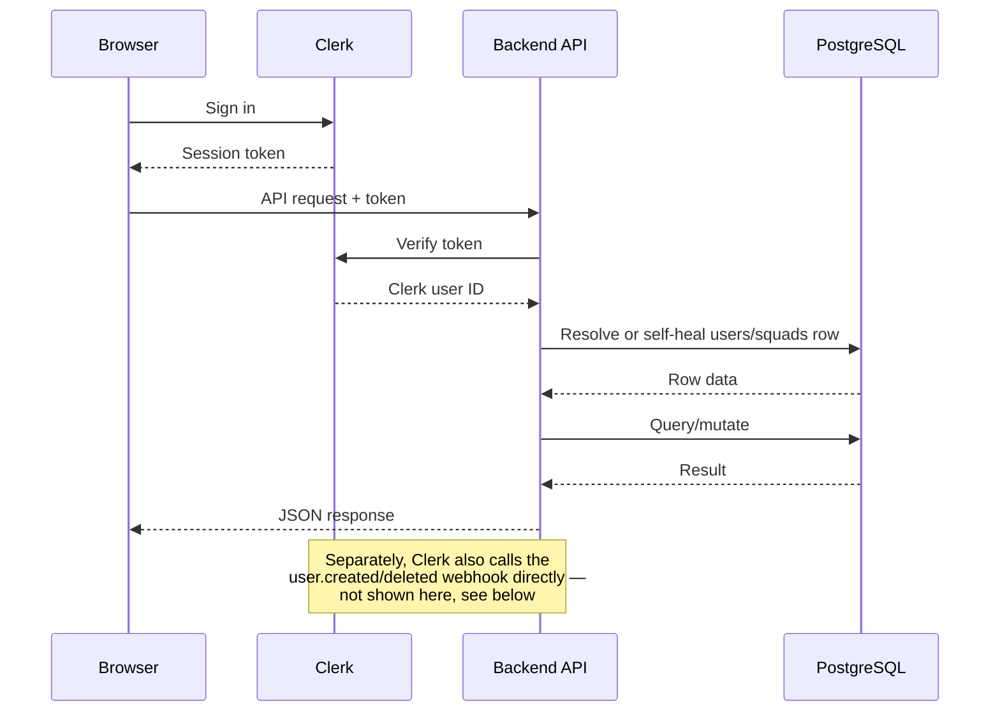

# Architecture Overview

The project is split into two independently deployable applications, per the
course's non-monolithic requirement:

```
┌─────────────────┐        HTTPS/JSON        ┌──────────────────┐
│                  │ ───────────────────────▶ │                  │
│  React frontend  │                           │  Express API      │
│  (Vite)          │ ◀─────────────────────── │  (Node.js)        │
│                  │                           │                  │
└────────┬─────────┘                           └────────┬─────────┘
         │                                               │
         │ auth (Clerk React SDK)                        │ auth verification
         ▼                                               │ + webhooks
   ┌───────────┐                                         ▼
   │   Clerk   │◀────────────────────────────────  ┌───────────┐
   │ (hosted)  │        user.created/deleted        │ PostgreSQL │
   └───────────┘             webhook                └───────────┘
```

## Request flow

1. A user signs in via Clerk on the frontend. Clerk issues a session token.
2. The frontend attaches that token to requests it makes to the backend API.
3. The backend's auth middleware (`@clerk/express`) verifies the token and
   extracts the Clerk user ID for the request.
4. Most routes then resolve that Clerk ID to an internal `users.id` and,
   where relevant, the squad the user owns or belongs to — self-healing
   (creating the `users`/`squads` row) the first time a given Clerk user is
   seen, since Clerk's `user.created` webhook may not always be able to
   reach a local dev server without a public tunnel.
5. Route handlers query PostgreSQL directly and return JSON.

## Why self-healing user/squad resolution?

Two independent paths can create a `users` row for the same Clerk account:
the `user.created` webhook (production, or any environment Clerk can reach),
and the API routes' own "get-or-create" helper (`_squad.js`), used as a
fallback anywhere a request arrives from a Clerk user the backend hasn't
seen yet. Both paths handle the Postgres unique-constraint race that can
occur if two requests try to create the same row concurrently, falling back
to a `SELECT` if their `INSERT` loses the race.

## Data ownership model

- A **coach** (`users.role = 'coach'`) owns exactly one **squad**
  (`squads.coach_id`, unique-constrained).
- A squad has many **athletes** and many **events**.
- An event has many **log entries** — the individual scoring/penalty/action
  records made during that event, each optionally tied to an athlete (a
  `null` athlete on a log entry represents an action attributed to the
  opponent, e.g. their goal).
- Log entries are **soft-deleted** (`deleted_at`), not removed outright —
  "undo" during live logging keeps a full audit trail rather than erasing
  history.
- An **assistant** (`users.role = 'assistant'`) is linked to a squad via
  `users.squad_id`, populated when they accept an **invite** created by the
  squad's coach.


  ---



Then, replace the existing "## Request flow" numbered list with the same
information as a sequence diagram (keep the numbered list too if you'd
rather have both — the diagram makes the ordering and the two entry
points for user-creation obvious at a glance, which is easy to miss
reading prose):



---


See [Data Model](./data-model.md) for the full schema.
