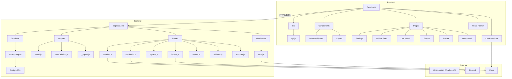

# Development View

The development view shows the main components and packages in the codebase.

## Component Diagram



## Package Structure

```
sport-coaching-tool/
├── backend/
│   ├── migrations/          # Database schema versions
│   ├── src/
│   │   ├── app.js           # Express app setup
│   │   ├── middleware/
│   │   │   └── auth.js      # Clerk token verification
│   │   ├── routes/
│   │   │   ├── _squad.js    # Squad/user resolution helpers
│   │   │   ├── account.js   # Account deletion
│   │   │   ├── athletes.js  # Roster CRUD
│   │   │   ├── events.js    # Events + live logging
│   │   │   ├── invites.js   # Assistant/athlete invites
│   │   │   ├── squads.js    # Squad CRUD
│   │   │   ├── weather.js   # Weather API proxy
│   │   │   └── webhooks.js  # Clerk webhooks
│   │   └── lib/
│   │       ├── userDeletion.js
│   │       └── email.js
│   └── tests/
│       └── integration/     # Integration tests with real DB
├── frontend/
│   ├── src/
│   │   ├── components/      # Layout, ProtectedRoute
│   │   ├── lib/
│   │   │   └── api.js       # API client
│   │   └── pages/           # Page components
│   └── public/
└── docs-site/
    └── docs/                # This documentation
```

## Separation of Concerns

| Layer | Responsibility |
|---|---|
| **Frontend pages** | UI rendering, user input, role-aware controls |
| **Frontend lib** | API calls, token handling |
| **Backend routes** | HTTP handling, request validation, response formatting |
| **Backend middleware** | Authentication, Clerk integration |
| **Backend helpers** | Shared business logic (squad resolution, deletion cleanup) |
| **Database** | Persistence, referential integrity, migrations |
