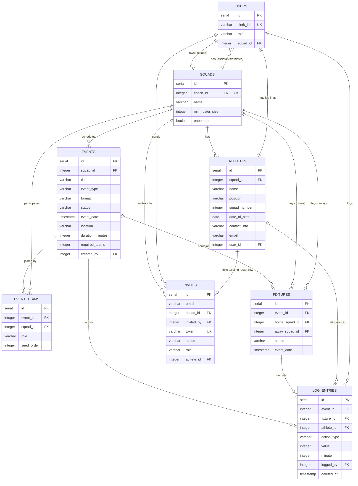

# Logical View

The logical view describes the main domain entities and their relationships.

## Entity Relationship Diagram

## Key Design Decisions

- **Coach owns one squad.** The `squads.coach_id` column is unique, enforcing that a coach has exactly one squad.
- **Athletes can be invited to log in.** The `athletes.user_id` links a roster row to a Clerk-backed user account once the athlete accepts an invite.
- **Log entries are the source of truth.** Stats are derived from `log_entries` rather than stored separately, preventing drift.
- **Soft deletes for logs.** The `deleted_at` column supports undo during live logging while preserving an audit trail.
- **Events support multiple formats.** A simple match/training uses only `events`; leagues and tournaments generate `fixtures` and `event_teams`.
