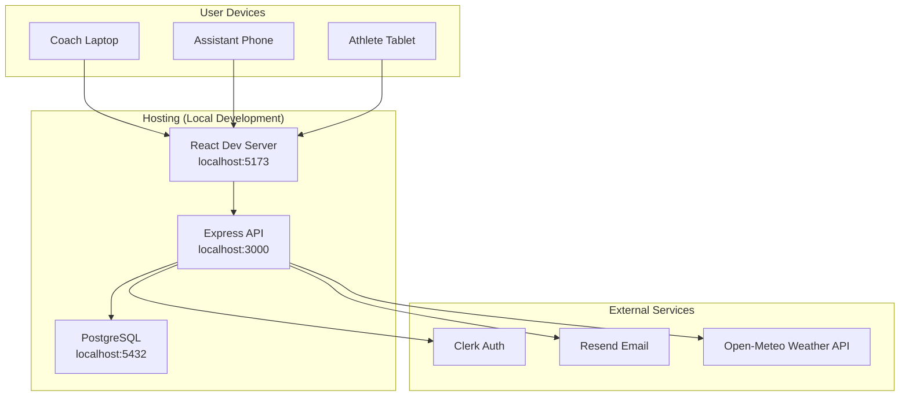
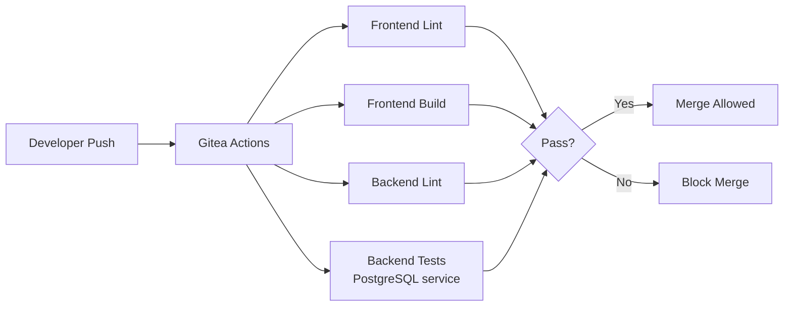

# Physical View

The physical view describes how the system is deployed and what infrastructure it runs on.

## Deployment Diagram

## Production Deployment Plan

For production, the application will be deployed as follows:

| Component | Planned Service | Reason |
|---|---|---|
| Frontend | Vercel / Netlify / Azure Static Web Apps | Static site hosting with CI-triggered deploys |
| Backend | Azure App Service / Railway / Render | Managed Node.js hosting with environment variables |
| Database | Azure Database for PostgreSQL / Supabase | Managed PostgreSQL with backups |
| Auth | Clerk (hosted) | No auth infrastructure to maintain |
| Email | Resend | Reliable transactional email |
| CI/CD | Gitea Actions + self-hosted runner | Already configured; can add deploy steps |

## Environment Variables

| Variable | Purpose |
|---|---|
| `CLERK_PUBLISHABLE_KEY` | Frontend Clerk SDK key |
| `CLERK_SECRET_KEY` | Backend Clerk SDK key |
| `CLERK_WEBHOOK_SECRET` | Verifies Clerk webhook signatures |
| `DATABASE_URL` | PostgreSQL connection string |
| `FRONTEND_URL` | Base URL for invite links |
| `RESEND_API_KEY` | Email service API key |

## CI/CD Pipeline

