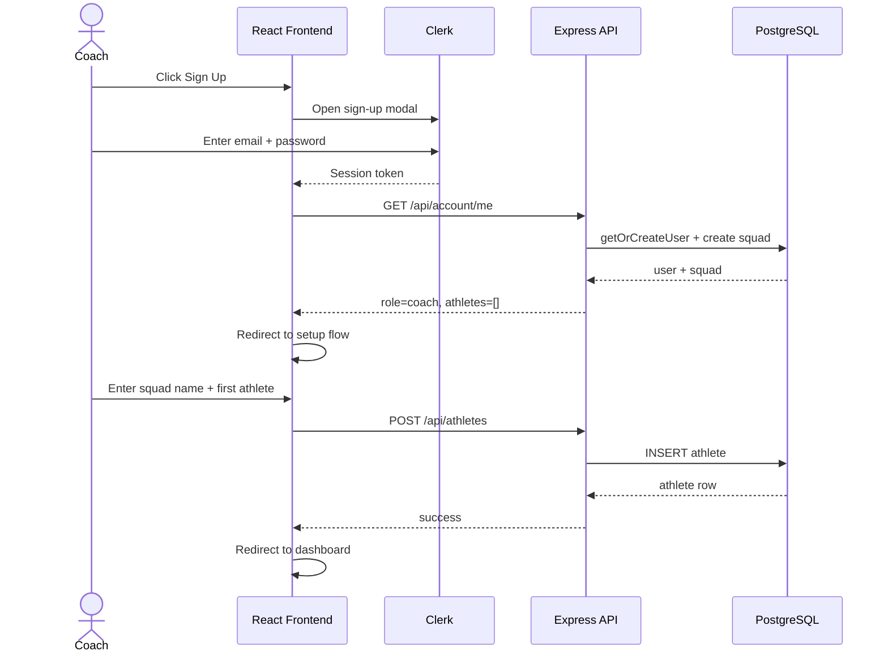
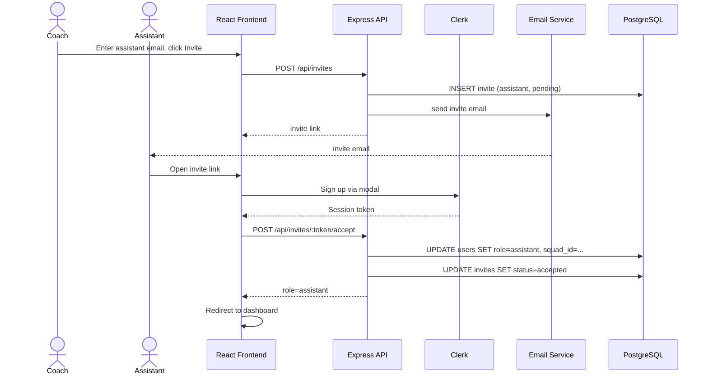
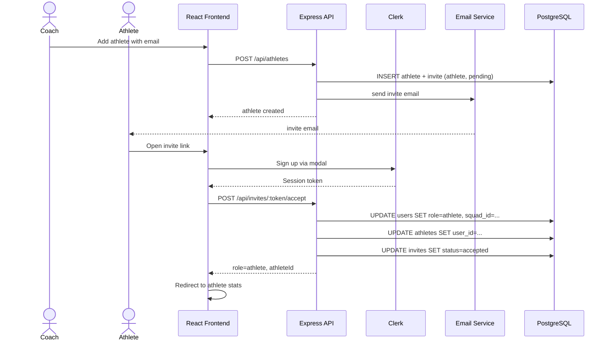
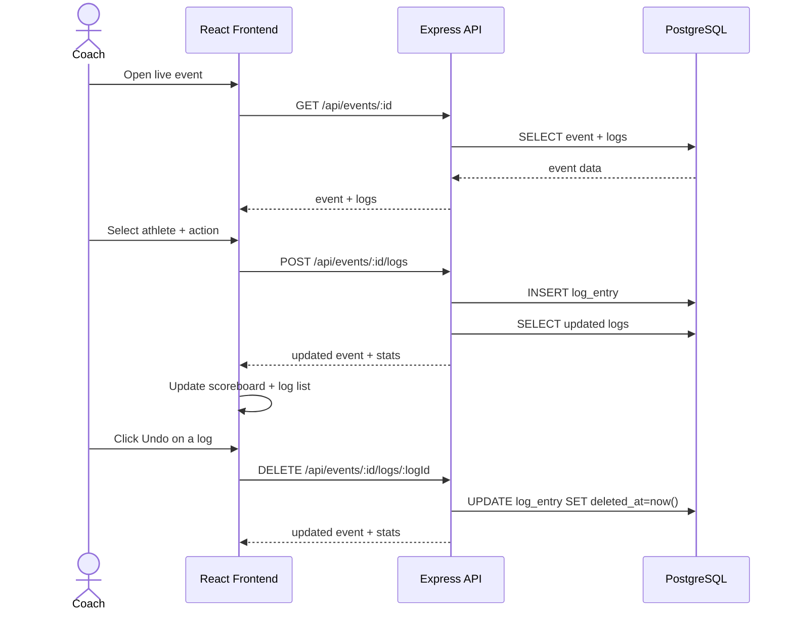
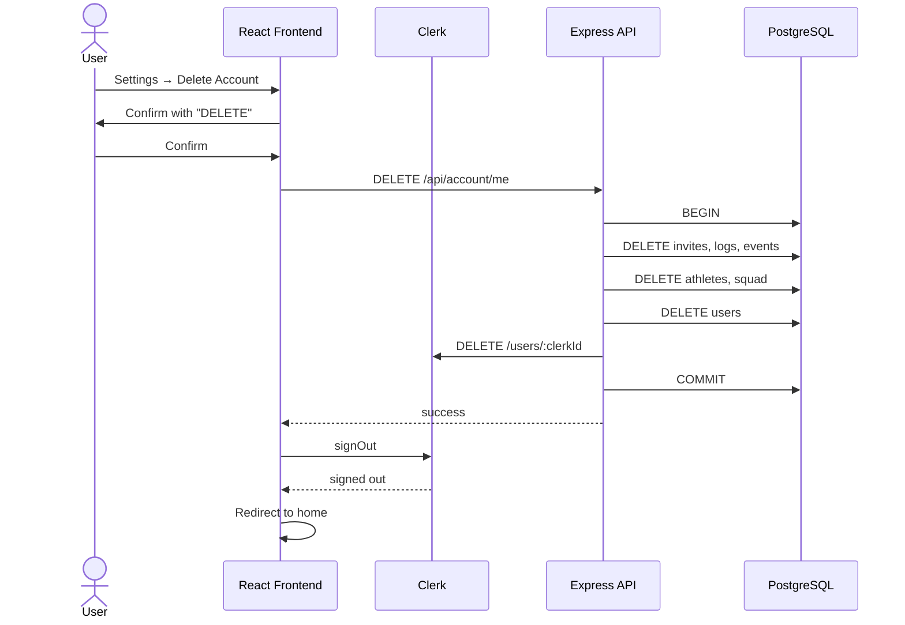

# Process View

The process view shows how the main user flows interact across the frontend, backend, Clerk, and database.

## Coach Sign-Up & Setup

## Assistant Invite Flow

## Athlete Invite Flow

## Live Match Logging

## Account Deletion

