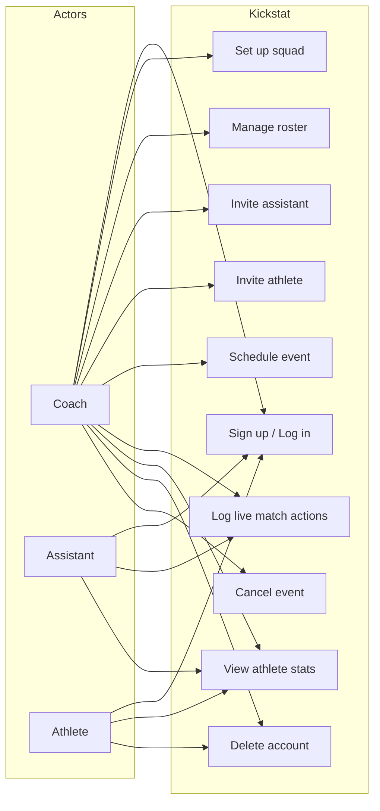

# Scenario View

The scenario view shows the main use cases from each user's perspective.

## Use Case Diagram

## Use Case Descriptions

### Coach use cases

| Use Case | Description | Priority |
|---|---|---|
| Set up squad | Create squad and add first athlete on first login | Must have |
| Manage roster | Add, edit, and remove athletes | Must have |
| Invite assistant | Send an invite email to an assistant | Must have |
| Invite athlete | Send an invite email to an athlete | Must have |
| Schedule event | Create matches and training sessions | Must have |
| Log live match actions | Record goals, cards, saves, substitutions | Must have |
| Cancel event | Mark an event as cancelled | Should have |
| Delete account | Remove account and all data | Must have |

### Assistant use cases

| Use Case | Description | Priority |
|---|---|---|
| View roster | See the squad list without editing | Must have |
| Log live match actions | Help record actions during a match | Must have |
| View athlete stats | See athlete performance data | Should have |

### Athlete use cases

| Use Case | Description | Priority |
|---|---|---|
| View personal stats | See own appearances, goals, cards | Must have |
| Delete account | Remove their own account | Should have |
