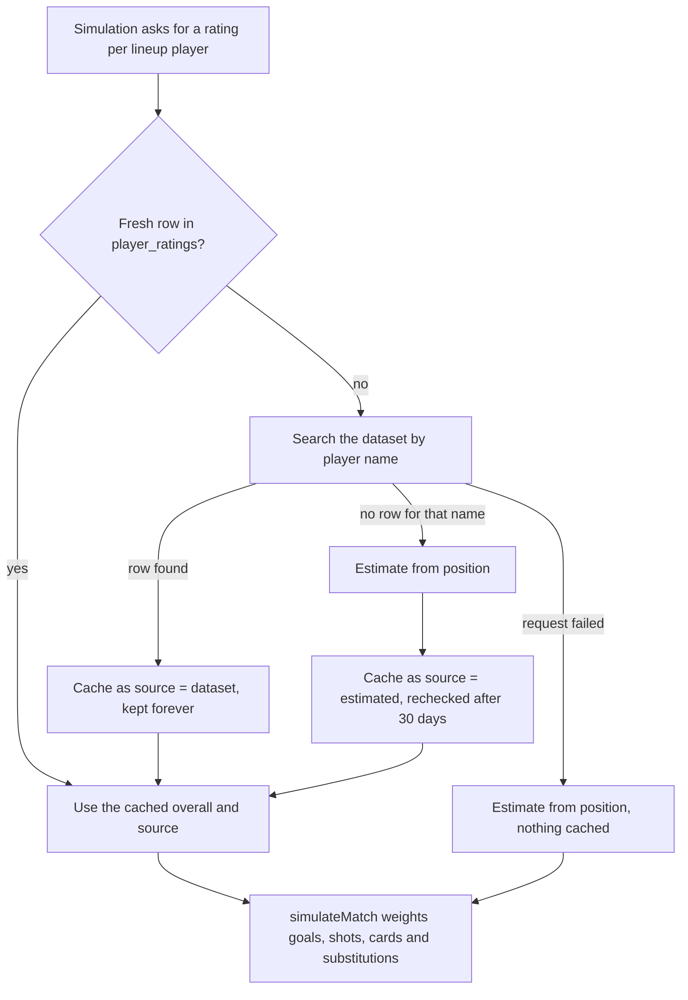

# EA FC Player Ratings Dataset

## What the ratings dataset does for us

The match simulator needs one number per player — an overall rating — so it can
weight the simulated 90 minutes by how good each side actually is. This dataset
supplies that number for real professionals; anyone it does not know about gets
a position-based estimate instead.

A rating is used for three things:

1. **Team strength** — every lineup player's overall is combined per side into
   attack, midfield and defence ratings.
2. **Chance creation** — the expected goals for a side come from its attack
   against the opposing defence, so a stronger team creates more chances
   without making upsets impossible.
3. **Who did it** — within a side, the share of goals, assists, shots and cards
   is weighted by position and rating, so strikers score more than centre-backs.

This powers the **Quick Sim** and **Simulate Match** buttons on the live match
page — an optional shortcut for the manual live logging flow (US13–US16) that
ends up in the same records, because the script is replayed through the ordinary
log endpoint. See the
[feature rationale](../product/feature-rationale.md) for why it exists.

## Why this dataset

- **No API key.** Nothing to register, nothing to store as a secret, and no way
  to accidentally burn a paid tier during coursework — the same reasoning as
  [Open-Meteo](./open-meteo.md).
- **It carries what the simulator needs**: player name, position and overall in
  one queryable dataset, rather than a stats feed that would have to be
  aggregated into a strength number ourselves.
- **It is swappable at runtime.** The API base, dataset, config and split are
  all environment variables, so pointing Kickstat at a newer EA FC release is a
  config change, not a code change.

The provider is the [Hugging Face datasets-server](https://huggingface.co/docs/datasets-server)
search endpoint over
[`jason1966/aayushmishra1512_fifa-2021-complete-player-data`](https://huggingface.co/datasets/jason1966/aayushmishra1512_fifa-2021-complete-player-data)
— a community-published snapshot of the FIFA 21 player database (one row per
player with name, nationality, position, overall, age and potential).

## Where it is used

| Piece | File |
|---|---|
| Rating lookup, cache and estimate fallback | `backend/src/lib/ratings.js` |
| Simulation engine that consumes the ratings | `backend/src/lib/match-simulation.js` |
| Cache table | `backend/migrations/1789904344007_add-player-ratings.js` |
| Endpoints | `POST /api/events/{id}/simulate`, `POST /api/fixtures/{id}/simulate` |
| Integration tests | `backend/tests/integration/simulation.integration.test.js` |
| Frontend replay and progress UI | `frontend/src/lib/simulation.js`, `frontend/src/pages/LiveMatch.jsx` |

Ratings are resolved from the saved lineup — starters **and** bench — so a
substitute who comes on already has a rating before they touch the ball.

## How a rating is resolved



1. Every lineup player's name is normalised into a cache key.
2. All keys for the match are looked up in `player_ratings` in a single query.
3. Only names with no fresh cache row are sent to the external API.
4. Each answer is written back to the cache, tagged with where it came from —
   `dataset` or `estimated`.
5. The resolved ratings are handed to `simulateMatch`, and the same payload is
   returned to the client so the UI can show dataset-versus-estimated counts.

## The upstream request

One `GET` per uncached name, with the player's name as the search query:

```bash
curl "https://datasets-server.huggingface.co/search?dataset=jason1966%2Faayushmishra1512_fifa-2021-complete-player-data&config=default&split=train&query=Lionel%20Messi&offset=0&length=10"
```

The datasets-server serialises a single-column dataset as a header/value pair,
so a row comes back looking like this:

```json
{
  "rows": [
    {
      "row_idx": 0,
      "row": {
        "player_id;name;nationality;position;overall;age;hits;potential;team":
          "231747;Lionel Messi;Argentina;RW;94;33;126;94;FC Barcelona"
      }
    }
  ]
}
```

`rowToRecord` in `ratings.js` splits that pair back into named fields, which is
what keeps a dataset swap cheap: a differently-ordered dataset still resolves
into `{ name, position, overall }` without a code change.

## Caching

Every lookup is recorded in the `player_ratings` table, keyed by the normalised
name (unique), with `overall`, `position`, `source` and `checked_at`:

| Case | What is stored | When it is looked up again |
|---|---|---|
| Dataset answered with a row | `source = 'dataset'` | Never — a real rating does not change |
| Dataset answered, player not in it | `source = 'estimated'` | After 30 days (`ESTIMATE_RECHECK_DAYS`), in case the player has since been added |
| Dataset unreachable or timed out | Nothing | Next time a simulation needs that player |

The third row is deliberate: a temporary outage must not permanently downgrade
a real professional to a positional estimate.

## What we do to keep external API usage low

- **Once per player, ever.** A dataset hit is cached forever, so replaying a
  match — or simulating the same squad again next week — costs no API calls.
- **One batch per match.** All names for a match are resolved together; cache
  hits never leave the database.
- **At most four lookups in flight** (`MAX_PARALLEL_LOOKUPS`). The public
  datasets-server is shared infrastructure, so a full squad is looked up in
  small waves instead of a burst of twenty requests.
- **One retry, only for slowness.** A cold query on that server regularly
  outlives the 6-second deadline (`REQUEST_TIMEOUT_MS`), so a timed-out query is
  retried once with a longer 12-second deadline (`RETRY_TIMEOUT_MS`) before the
  player is treated as unknown.
- **Circuit breaker on real failures.** A DNS failure, a 5xx or any other
  thrown error flips a `providerDown` flag for the rest of that run: every
  remaining unknown player falls back to an estimate immediately. An outage
  therefore costs one timeout, not one per player — and the 12-second retry is
  deliberately *not* attempted on hard failures, so a real outage never makes
  the coach wait twice as long for the same estimate.

The measured worst case is what set those numbers: with no cap, a name the
dataset does not carry could hold a simulation open for around 40 seconds.

## Position-based fallback estimates

Players the dataset does not know about — youth players, invented names, and
real players whose name differs in this snapshot — are estimated from the
position they play, always inside a **70–85 overall** band.

| Position group | Base rating |
|---|---|
| GK | 74 |
| CB, FB | 75 |
| DM, CM | 76 |
| AM, W | 78 |
| ST | 79 |

The estimate is deterministic: a djb2 hash of `normalised name + position
group` spreads players across the band (base ± 7), and the final value is
clamped to 70–85. The same player therefore always gets the same estimate,
while a squad of unknown players still varies realistically. Anything that
cannot be classified — including an empty position — falls into the midfield
band.

Free-text positions are mapped onto those groups first, so `"Left Back"`,
`"LB"` and `"wing back"` all land in the full-back group, and `"goalkeeper"`,
`"GK"` and `"keeper"` all land in the keeper group.

## Name matching

Names are normalised before comparison: accents stripped, lowercased,
punctuation collapsed to spaces. Matching is then an exact comparison against
the dataset's `name` field, and the first row with a parseable overall wins.

This is intentionally simple, and it has one visible consequence: the dataset's
spelling has to match the roster spelling. `"Erling Haaland"` misses because
this 2021 snapshot stores him as `"Erling Braut Haaland"`, so he is estimated
from his position instead. The estimate still produces a sensible rating, and
the API response records `source: "estimated"` so the difference is visible
rather than silent. If the roster uses the dataset's spelling, the real overall
is picked up.

## Environment variables

All four are optional — the defaults below are compiled into `ratings.js`:

| Variable | Default | Purpose |
|---|---|---|
| `PLAYER_RATINGS_API_BASE` | `https://datasets-server.huggingface.co` | Base URL of the datasets-server |
| `PLAYER_RATINGS_DATASET` | `jason1966/aayushmishra1512_fifa-2021-complete-player-data` | Dataset to search |
| `PLAYER_RATINGS_DATASET_CONFIG` | `default` | Dataset config |
| `PLAYER_RATINGS_DATASET_SPLIT` | `train` | Dataset split |

Because there is no key, a missing or wrong value here cannot break the
feature — it degrades to estimates rather than erroring.

## What the simulation endpoints return

Both simulate endpoints return the script plus a `ratings` payload keyed by
athlete id and a `summary`:

```json
{
  "mode": "quick",
  "events": [{ "minute": 24, "team_side": "home", "action_type": "goal", "is_scoring": true, "athlete_id": 11, "assist_athlete_id": 7 }],
  "ratings": { "11": { "overall": 91, "position": "CM", "source": "dataset" }, "18": { "overall": 76, "position": "ST", "source": "estimated" } },
  "summary": {
    "homeStrength": 82.4,
    "awayStrength": 79.1,
    "homeExpectedGoals": 2.03,
    "awayExpectedGoals": 1.32,
    "homeGoals": 2,
    "awayGoals": 1,
    "eventCount": 27
  }
}
```

The endpoints only *build* the script — nothing is written to the database at
this point. The client replays it through the normal log endpoint, so a
simulated match is recorded exactly like a manually logged one. See the API
reference at `/api/docs` for the full request and response shapes.

## Failure handling

- **Dataset unreachable** — every unknown player is estimated, the simulation
  still completes, and nothing is cached.
- **Slow query** — one longer retry, then estimate.
- **Player not in the dataset** — estimated from position, cached and re-checked
  after 30 days.
- **No starting XI, or a cancelled/finished match** — the endpoint returns
  `400` before any lookup happens, so no API calls are wasted.
- **League/tournament events** — rejected with "Use fixture endpoints to
  simulate league matches"; ratings for those are resolved per fixture.

## Tests

`backend/tests/integration/simulation.integration.test.js` covers the lookup
path with a stubbed network (`global.fetch` is replaced per test), including
cache hits on a second call, the retry-after-timeout path, the "hard failure is
not retried" behaviour, and the positional estimate for an unknown name. That
is what keeps the API-economy rules above from regressing silently.

## Compliance and attribution

Player rating data in this dataset originates from EA's FIFA series and is
published as a community snapshot on Hugging Face; Kickstat makes no claim to
it. We do not redistribute raw dataset rows — a lookup stores a single overall
and position per athlete in our own database for scheduling performance, and
the data is only used to weight simulated outcomes inside the app. No API key
or paid plan is involved, and swapping `PLAYER_RATINGS_DATASET` to a newer
release is the intended forward path.
